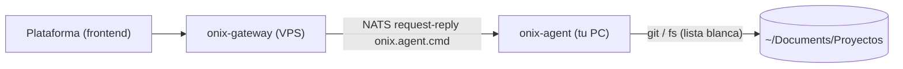

# onix-agent

Demonio que corre **en tu PC** (FASE 6). Es la única vía para que la plataforma OnixGuard (en el VPS) opere sobre tu máquina: **listar proyectos**, **validar si un repo está local** y **clonarlo**. Conexión **saliente** a NATS (en prod: TLS + token), acciones de **lista blanca**, acotadas a un directorio base. Nunca ejecuta comandos arbitrarios.

> ⚠️ **Repo pendiente de crear por el jefe:** aún no existe `onix-agent` en GitHub. Está como repo local (`git init`, rama `main`). Cuando crees el repo, agrega el remote y haz push.

---

## Qué hace (lista blanca)
| Acción (NATS request-reply en `onix.agent.cmd`) | Qué hace |
|---|---|
| `project.list` | Lista las carpetas del directorio base, marcando cuáles son repos git. |
| `repo.check {name}` | Indica si `<base>/<name>` existe localmente. |
| `repo.clone {url}` | `git clone --depth 1` dentro del directorio base (si no existe ya). |

Todo destino se acota con `filepath.Base` (anti path-traversal): nunca escribe fuera del directorio base.

## Flujo


## Config (entorno)
| Var | Default | Uso |
|-----|---------|-----|
| `NATS_URL` | `nats://localhost:4222` | Bus (en prod: TLS saliente al VPS). |
| `NATS_TOKEN` | — | Token de máquina (prod). |
| `ONIX_PROJECTS_DIR` | `~/Documents/Proyectos` | Directorio base de proyectos. |

## Correr (dev)
```bash
go build -o onix-agent ./cmd/onix-agent
NATS_URL=nats://localhost:4222 ./onix-agent
```
Con el stack de `onix-deploy` levantado, el gateway enruta `GET /api/projects`, `POST /api/projects/check`, `POST /api/projects/clone` a este agente.

## Estructura
```text
cmd/onix-agent/main.go      # NATS request-reply + dispatch de acciones
internal/actions/           # project.list / repo.check / repo.clone (lista blanca, acotadas)
```

---

*Parte de OnixGuard · Fase 6 (Proyectos + repos). Ver [[Arquitectura v2 — plataforma de ejecución]].*
